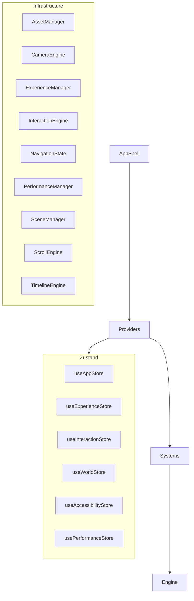
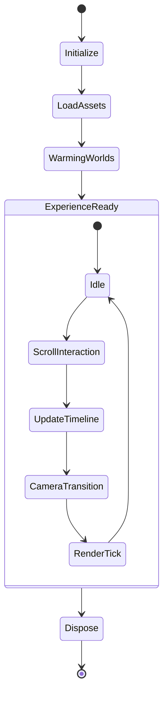

# Architecture Specification (Phase 2: Experience Engine)

## Repository Tree

```
src/
├── app/          # App Shell, Routing, and global styles entry
├── assets/       # Static non-code assets
├── components/   # Generic reusable DOM elements
├── config/       # Environment configs and constants
├── core/         # Core singletons or third-party wrappers
├── experience/   # R3F Experience orchestrators
├── hooks/        # Global React custom hooks
├── interaction/  # DOM Interaction layers (ScrollManager, etc)
├── lib/          # External library configurations
├── providers/    # React Context Boundaries
├── rendering/    # WebGL / Three.js R3F Canvases
├── stores/       # Zustand state management
├── styles/       # Tailwind CSS v4 variables and globals
├── systems/      # Decoupled Engine Managers (The Core Infrastructure)
├── tests/        # Unit & E2E tests
├── types/        # Global TypeScript interfaces
├── utils/        # Pure helper functions
└── worlds/       # Project-specific 3D worlds (Empty currently)
```

## Folder Purpose
* **systems/**: Pure infrastructure. They own a specific lifecycle (Scene, Camera, Timeline) and expose APIs without holding project-specific semantics or visual UI logic.
* **stores/**: Reactive state bounds. Only hold normalized state data.
* **providers/**: Bridge between `systems`/`stores` and the React/DOM lifecycle.
* **rendering/**: Canvas mounting and WebGL environment setup.
* **interaction/**: DOM-specific event delegation (Lenis scrolling).

## Manager Responsibilities

1. **AssetManager**: Streaming, preloading, caching, and disposal of files (GLTF, textures). No specific project assets yet.
2. **CameraEngine**: Owns camera state, FOV, target constraints, and transitions. No predefined choreography.
3. **ExperienceManager**: Owns the narrative journey, chapters, and overall experience lifecycle progression.
4. **InteractionEngine**: Normalizes Mouse, Touch, Wheel, and Focus pointer logic without visual representations.
5. **NavigationState**: Holds the active chapter, section, and progression state. No navigation UI implementations.
6. **PerformanceManager**: Exposes moving-average FPS and memory metrics only. It does not automatically trigger quality drops.
7. **SceneManager**: Owns the global R3F scene lifecycle (adding/removing geometries). Has no knowledge of specific "worlds".
8. **ScrollEngine**: Integrates Lenis for smooth scroll hijacking and exposes playback controls (`pause`, `resume`, `scrollTo`).
9. **TimelineEngine**: Coordinates and registers GSAP timelines. It contains no project-specific animations or semantics.

## Provider Responsibilities

1. **AccessibilityProvider**: Coordinates a11y focus outlines and respects `prefers-reduced-motion` settings via Zustand.
2. **ExperienceProvider**: Acts as the bridge between `ExperienceManager` and `useExperienceStore`.
3. **InteractionProvider**: Mounts global event listeners (mousemove, mousedown, etc) and feeds `InteractionEngine` / `useInteractionStore`.
4. **RenderProvider**: Hooks into `PerformanceManager` to relay tier capabilities to the `RenderCanvas`.
5. **ThemeProvider**: Manages document-level CSS variables based on `useAppStore` theme state.

## Store Responsibilities

1. **useAccessibilityStore**: State for high-contrast and reduced-motion preferences.
2. **useAppStore**: Global application status (theme, asset loading progress).
3. **useExperienceStore**: Tracks active chapter, current world, and journey progress percentages.
4. **useInteractionStore**: Normalized interaction state (cursor position, hover target, scroll progress, focus).
5. **usePerformanceStore**: Performance state representation (currently just holding the tier type).
6. **useWorldStore**: Manages lists of loaded, active, and warming worlds.

## Ownership Diagram



## Lifecycle Diagram



## Dependency Rules
1. **Strict Types**: No `any`. Everything must be strictly typed.
2. **No Implicit Coupling**: Managers do not import each other directly; they communicate via Stores, Context Providers, or explicitly passed interfaces.
3. **Single Responsibility**: Every Manager owns exactly one domain (e.g. `CameraEngine` does not touch timelines; `TimelineEngine` does not touch cameras).
4. **No UI in Infrastructure**: Stores and Systems must never assume the existence of a specific DOM node, except when explicitly passed (like the app root).

## Public APIs

- `AssetManager`: `init`, `queueAssets`, `loadQueue`, `getAsset`, `disposeAsset`
- `CameraEngine`: `init`, `updateState`, `getState`, `update`
- `ExperienceManager`: `init`, `advanceChapter`, `setChapterProgress`, `update`, `getProgress`
- `InteractionEngine`: `init`, `updateCoordinates`, `setHoverState`, `setDownState`, `getState`
- `NavigationState`: `getState`, `setChapter`, `setSection`, `setJourneyProgress`, `reset`
- `PerformanceManager`: `init`, `recordFrame`, `getMetrics`
- `SceneManager`: `init`, `add`, `remove`, `update`
- `ScrollEngine`: `init`, `pause`, `resume`, `scrollTo`, `getProgress`, `update`
- `TimelineEngine`: `init`, `registerTimeline`, `getTimeline`, `disposeTimeline`

## Initialization Order

1. React DOM mounts `App.tsx`
2. `ThemeProvider` & `AccessibilityProvider` resolve base document states.
3. `InteractionProvider` & `ScrollManager` attach event listeners to `window` and `document`.
4. `RenderProvider` checks initial hardware capabilities.
5. `ExperienceProvider` boots `ExperienceManager` and `SceneManager`.
6. WebGL `RenderCanvas` mounts, fetching its context from the initialized providers.

## Application Flow

1. User visits site.
2. Core providers boot up instantly.
3. Blank screen/shell is displayed (future loader UI).
4. Assets are queued via `AssetManager`.
5. Upon load completion, `ExperienceManager` marks state as `ExperienceReady`.

## Experience Flow

1. User triggers a progression action (scroll).
2. `ScrollEngine` registers progress delta.
3. `InteractionStore` updates global progress state.
4. `ExperienceManager` evaluates if a chapter boundary is crossed.
5. `TimelineEngine` seeks to the corresponding percentage.

## Rendering Flow

1. `requestAnimationFrame` loop initiated by R3F `<Canvas>`.
2. `PerformanceManager` records frame delta.
3. `CameraEngine` interpolates positions.
4. `SceneManager` applies any global ambient updates.
5. Scene is rendered to screen.

## Interaction Flow

1. User moves pointer.
2. `InteractionProvider` captures `mousemove`.
3. Coordinates are normalized and passed to `InteractionEngine` / `useInteractionStore`.
4. Relevant subscribers (e.g. `CameraEngine` for parallax) read updated values on the next frame.
